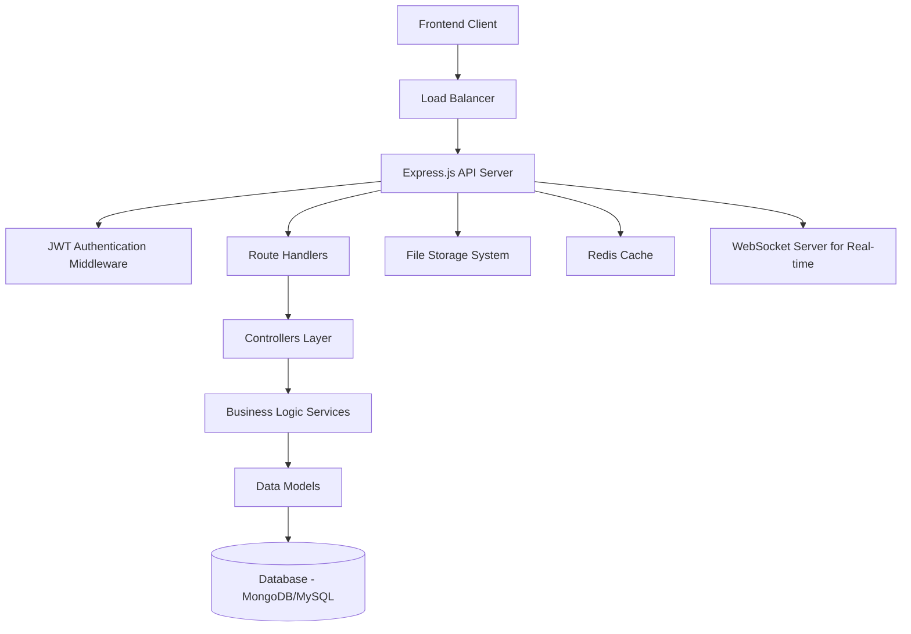
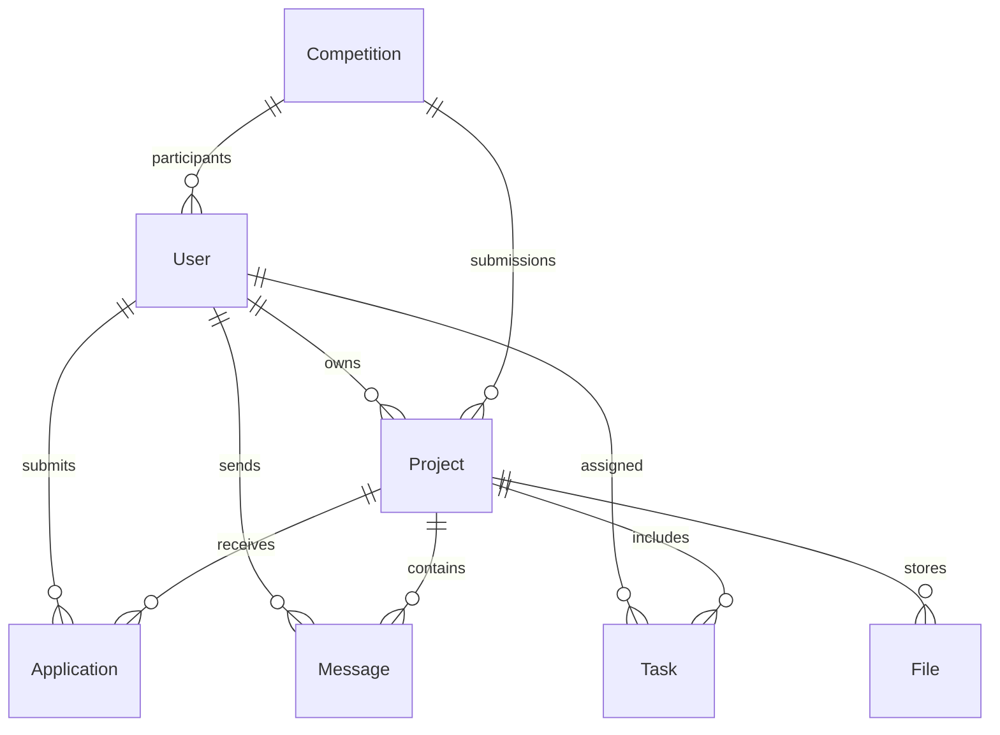

# Design Document

## Overview

The collaborative platform backend is designed as a RESTful API service built with Node.js and Express.js, following a layered architecture pattern. The system will handle user authentication via JWT, manage complex project collaboration workflows, and provide real-time communication capabilities. The architecture prioritizes scalability, security, and maintainability while supporting the existing project structure.

## Architecture

### High-Level Architecture



### Technology Stack

- **Runtime**: Node.js with ES6 modules
- **Framework**: Express.js 4.x
- **Authentication**: JSON Web Tokens (JWT)
- **Database**: MongoDB (primary) with MySQL fallback option
- **Caching**: Redis for session management and performance
- **File Storage**: Local filesystem with cloud storage integration ready
- **Real-time**: WebSocket or Socket.io for chat and notifications
- **Validation**: Express-validator for input validation
- **Security**: Helmet.js, bcrypt for password hashing, rate limiting

### Directory Structure

```
backend/
├── server.js                 # Main server entry point
├── config/
│   ├── database.js           # Database configuration
│   ├── jwt.js               # JWT configuration
│   └── environment.js       # Environment variables
├── middleware/
│   ├── auth.js              # JWT authentication middleware
│   ├── validation.js        # Input validation middleware
│   ├── rateLimiter.js       # Rate limiting middleware
│   └── errorHandler.js      # Global error handling
├── models/
│   ├── User.js              # User data model
│   ├── Project.js           # Project data model
│   ├── Team.js              # Team management model
│   ├── Application.js       # Project application model
│   ├── Message.js           # Chat message model
│   ├── Task.js              # Task management model
│   ├── Competition.js       # Competition/hackathon model
│   └── File.js              # File upload model
api/
├── controllers/
│   ├── authController.js    # Authentication logic
│   ├── userController.js    # User management (existing)
│   ├── projectController.js # Project CRUD operations
│   ├── teamController.js    # Team management
│   ├── applicationController.js # Application handling
│   ├── chatController.js    # Real-time messaging
│   ├── taskController.js    # Task management
│   ├── searchController.js  # Search and filtering
│   ├── competitionController.js # Competition management
│   ├── adminController.js   # Administrative functions
│   └── fileController.js    # File upload/download
├── routes/
│   ├── index.js            # Main route aggregator (existing)
│   ├── auth.js             # Authentication routes
│   ├── users.js            # User routes
│   ├── projects.js         # Project routes
│   ├── teams.js            # Team routes
│   ├── applications.js     # Application routes
│   ├── chat.js             # Chat routes
│   ├── tasks.js            # Task routes
│   ├── search.js           # Search routes
│   ├── competitions.js     # Competition routes
│   ├── admin.js            # Admin routes
│   └── files.js            # File routes
└── services/
    ├── authService.js      # Authentication business logic
    ├── userService.js      # User business logic
    ├── projectService.js   # Project business logic
    ├── teamService.js      # Team business logic
    ├── applicationService.js # Application business logic
    ├── chatService.js      # Chat business logic
    ├── taskService.js      # Task business logic
    ├── searchService.js    # Search business logic
    ├── competitionService.js # Competition business logic
    ├── adminService.js     # Admin business logic
    ├── fileService.js      # File handling business logic
    ├── emailService.js     # Email notifications
    └── notificationService.js # Push notifications
```

## Components and Interfaces

### Authentication System

**JWT Token Structure:**
```javascript
{
  userId: ObjectId,
  email: String,
  role: String, // 'user', 'admin', 'moderator'
  iat: Number,
  exp: Number
}
```

**Authentication Middleware:**
- Validates JWT tokens on protected routes
- Extracts user information for request context
- Handles token refresh logic
- Implements role-based access control

### User Management Component

**User Model Schema:**
```javascript
{
  _id: ObjectId,
  email: String (unique, required),
  password: String (hashed, required),
  profile: {
    firstName: String,
    lastName: String,
    bio: String,
    skills: [String],
    experience: String,
    location: String,
    avatar: String,
    socialLinks: {
      github: String,
      linkedin: String,
      portfolio: String
    }
  },
  preferences: {
    emailNotifications: Boolean,
    pushNotifications: Boolean
  },
  status: String, // 'active', 'suspended', 'deleted'
  createdAt: Date,
  updatedAt: Date,
  lastLogin: Date
}
```

### Project Management Component

**Project Model Schema:**
```javascript
{
  _id: ObjectId,
  title: String (required),
  description: String (required),
  vision: String,
  category: String,
  tags: [String],
  status: String, // 'draft', 'active', 'completed', 'archived'
  stage: String, // 'ideation', 'development', 'testing', 'deployment'
  owner: ObjectId (ref: User),
  team: [{
    user: ObjectId (ref: User),
    role: String, // 'owner', 'admin', 'member', 'contributor'
    joinedAt: Date
  }],
  requirements: {
    skills: [String],
    experience: String,
    commitment: String
  },
  timeline: {
    startDate: Date,
    endDate: Date,
    milestones: [{
      title: String,
      description: String,
      dueDate: Date,
      completed: Boolean
    }]
  },
  visibility: String, // 'public', 'private', 'team-only'
  applications: [ObjectId (ref: Application)],
  createdAt: Date,
  updatedAt: Date
}
```

### Team Management Component

**Team Operations Interface:**
```javascript
interface TeamService {
  addMember(projectId, userId, role): Promise<Team>
  removeMember(projectId, userId): Promise<Team>
  updateMemberRole(projectId, userId, newRole): Promise<Team>
  getTeamMembers(projectId): Promise<User[]>
  validatePermissions(userId, projectId, action): Promise<Boolean>
}
```

### Application System Component

**Application Model Schema:**
```javascript
{
  _id: ObjectId,
  project: ObjectId (ref: Project),
  applicant: ObjectId (ref: User),
  message: String,
  skills: [String],
  experience: String,
  portfolio: String,
  status: String, // 'pending', 'accepted', 'rejected', 'withdrawn'
  reviewedBy: ObjectId (ref: User),
  reviewedAt: Date,
  reviewNotes: String,
  createdAt: Date,
  updatedAt: Date
}
```

### Real-time Communication Component

**Message Model Schema:**
```javascript
{
  _id: ObjectId,
  project: ObjectId (ref: Project),
  sender: ObjectId (ref: User),
  content: String,
  type: String, // 'text', 'file', 'system', 'task-update'
  metadata: {
    fileName: String,
    fileSize: Number,
    taskId: ObjectId
  },
  readBy: [{
    user: ObjectId (ref: User),
    readAt: Date
  }],
  createdAt: Date,
  editedAt: Date
}
```

**WebSocket Events:**
```javascript
// Client to Server
'join-project': { projectId }
'send-message': { projectId, content, type }
'typing-start': { projectId }
'typing-stop': { projectId }

// Server to Client
'message-received': { message, sender }
'user-joined': { user }
'user-left': { user }
'typing-indicator': { user, isTyping }
'notification': { type, data }
```

### Task Management Component

**Task Model Schema:**
```javascript
{
  _id: ObjectId,
  project: ObjectId (ref: Project),
  title: String (required),
  description: String,
  assignee: ObjectId (ref: User),
  assignedBy: ObjectId (ref: User),
  status: String, // 'todo', 'in-progress', 'review', 'completed'
  priority: String, // 'low', 'medium', 'high', 'urgent'
  tags: [String],
  dueDate: Date,
  estimatedHours: Number,
  actualHours: Number,
  dependencies: [ObjectId (ref: Task)],
  attachments: [ObjectId (ref: File)],
  comments: [{
    user: ObjectId (ref: User),
    content: String,
    createdAt: Date
  }],
  createdAt: Date,
  updatedAt: Date,
  completedAt: Date
}
```

### Search and Discovery Component

**Search Service Interface:**
```javascript
interface SearchService {
  searchProjects(query, filters, pagination): Promise<SearchResult>
  searchUsers(query, filters, pagination): Promise<SearchResult>
  getRecommendations(userId): Promise<Project[]>
  buildSearchIndex(): Promise<void>
  updateSearchIndex(entityType, entityId): Promise<void>
}
```

**Search Filters:**
```javascript
{
  category: String,
  skills: [String],
  experience: String,
  location: String,
  status: String,
  dateRange: {
    start: Date,
    end: Date
  },
  sortBy: String, // 'relevance', 'date', 'popularity'
  sortOrder: String // 'asc', 'desc'
}
```

### Competition Management Component

**Competition Model Schema:**
```javascript
{
  _id: ObjectId,
  title: String (required),
  description: String,
  rules: String,
  category: String,
  status: String, // 'upcoming', 'active', 'judging', 'completed'
  timeline: {
    registrationStart: Date,
    registrationEnd: Date,
    submissionStart: Date,
    submissionEnd: Date,
    judgingEnd: Date,
    resultsAnnouncement: Date
  },
  prizes: [{
    position: Number,
    title: String,
    amount: Number, // in INR
    description: String
  }],
  participants: [ObjectId (ref: User)],
  submissions: [{
    team: [ObjectId (ref: User)],
    project: ObjectId (ref: Project),
    submittedAt: Date,
    score: Number,
    feedback: String
  }],
  judges: [ObjectId (ref: User)],
  leaderboard: [{
    team: [ObjectId (ref: User)],
    score: Number,
    rank: Number
  }],
  createdBy: ObjectId (ref: User),
  createdAt: Date,
  updatedAt: Date
}
```

## Data Models

### Database Design Principles

1. **Normalization**: Maintain referential integrity while avoiding over-normalization
2. **Indexing**: Strategic indexing on frequently queried fields
3. **Denormalization**: Selective denormalization for performance-critical queries
4. **Soft Deletes**: Implement soft deletes for audit trails and data recovery

### Key Relationships



### Database Indexes

**MongoDB Indexes:**
```javascript
// Users
db.users.createIndex({ email: 1 }, { unique: true })
db.users.createIndex({ "profile.skills": 1 })
db.users.createIndex({ status: 1, createdAt: -1 })

// Projects
db.projects.createIndex({ owner: 1, status: 1 })
db.projects.createIndex({ tags: 1, category: 1 })
db.projects.createIndex({ "team.user": 1 })
db.projects.createIndex({ createdAt: -1 })

// Applications
db.applications.createIndex({ project: 1, status: 1 })
db.applications.createIndex({ applicant: 1, createdAt: -1 })

// Messages
db.messages.createIndex({ project: 1, createdAt: -1 })
db.messages.createIndex({ sender: 1 })

// Tasks
db.tasks.createIndex({ project: 1, status: 1 })
db.tasks.createIndex({ assignee: 1, dueDate: 1 })
```

## Error Handling

### Error Classification

1. **Validation Errors** (400): Invalid input data
2. **Authentication Errors** (401): Invalid or missing credentials
3. **Authorization Errors** (403): Insufficient permissions
4. **Not Found Errors** (404): Resource doesn't exist
5. **Conflict Errors** (409): Resource conflicts (duplicate email, etc.)
6. **Server Errors** (500): Internal server issues

### Error Response Format

```javascript
{
  error: {
    code: String,
    message: String,
    details: Object, // Optional validation details
    timestamp: String,
    requestId: String
  }
}
```

### Global Error Handler

```javascript
const errorHandler = (err, req, res, next) => {
  const error = {
    code: err.code || 'INTERNAL_ERROR',
    message: err.message || 'Internal server error',
    timestamp: new Date().toISOString(),
    requestId: req.id
  };

  if (err.name === 'ValidationError') {
    error.details = err.errors;
    return res.status(400).json({ error });
  }

  if (err.name === 'JsonWebTokenError') {
    error.code = 'INVALID_TOKEN';
    return res.status(401).json({ error });
  }

  // Log server errors
  if (err.status >= 500) {
    console.error('Server Error:', err);
  }

  res.status(err.status || 500).json({ error });
};
```

## Testing Strategy

### Testing Pyramid

1. **Unit Tests** (70%): Individual functions and methods
2. **Integration Tests** (20%): API endpoints and database interactions
3. **End-to-End Tests** (10%): Complete user workflows

### Testing Tools

- **Jest**: Unit and integration testing framework
- **Supertest**: HTTP assertion library for API testing
- **MongoDB Memory Server**: In-memory database for testing
- **Sinon**: Mocking and stubbing library

### Test Categories

**Unit Tests:**
- Service layer business logic
- Utility functions
- Data model validation
- Authentication middleware

**Integration Tests:**
- API endpoint responses
- Database operations
- Authentication flows
- File upload/download

**End-to-End Tests:**
- User registration and login
- Project creation and management
- Team collaboration workflows
- Competition participation

### Test Data Management

```javascript
// Test fixtures
const testUsers = {
  regularUser: {
    email: 'user@test.com',
    password: 'password123',
    profile: { firstName: 'Test', lastName: 'User' }
  },
  adminUser: {
    email: 'admin@test.com',
    password: 'admin123',
    role: 'admin'
  }
};

const testProjects = {
  publicProject: {
    title: 'Test Project',
    description: 'Test Description',
    visibility: 'public'
  }
};
```

### Performance Testing

- **Load Testing**: Simulate concurrent users
- **Stress Testing**: Test system limits
- **Database Performance**: Query optimization
- **Memory Usage**: Monitor for memory leaks

## Security Considerations

### Authentication Security

- JWT tokens with reasonable expiration times
- Secure password hashing with bcrypt (12+ rounds)
- Rate limiting on authentication endpoints
- Account lockout after failed attempts

### Authorization Security

- Role-based access control (RBAC)
- Resource-level permissions
- API endpoint protection
- Admin function isolation

### Data Security

- Input validation and sanitization
- SQL/NoSQL injection prevention
- XSS protection
- CSRF protection with tokens

### Infrastructure Security

- HTTPS enforcement
- Security headers (Helmet.js)
- Environment variable protection
- Dependency vulnerability scanning

## Performance Optimization

### Caching Strategy

- Redis for session storage
- API response caching
- Database query result caching
- Static file caching

### Database Optimization

- Strategic indexing
- Query optimization
- Connection pooling
- Read replicas for scaling

### API Optimization

- Response compression
- Pagination for large datasets
- Lazy loading for related data
- API versioning for backward compatibility

## Scalability Considerations

### Horizontal Scaling

- Stateless application design
- Load balancer configuration
- Database sharding strategies
- Microservices migration path

### Monitoring and Logging

- Application performance monitoring
- Error tracking and alerting
- Database performance metrics
- User activity analytics

This design provides a comprehensive foundation for building a scalable, secure, and maintainable collaborative platform backend that addresses all the requirements while following industry best practices.